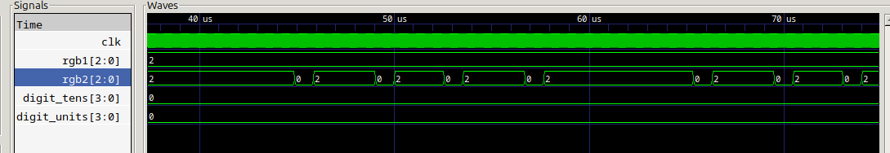
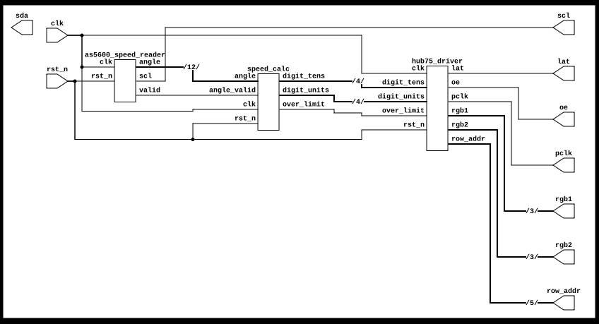
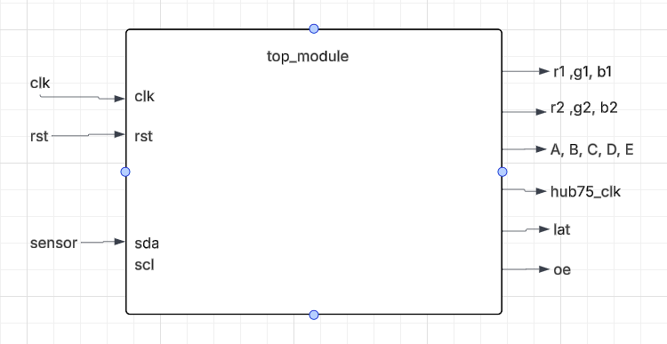
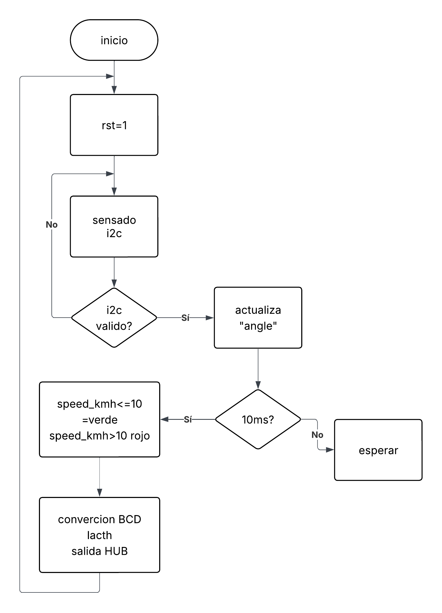

# Velocimetro digital

Este documento describe el diseño e implementación de un velocímetro digital basado en FPGA Lattice ECP5 (Colorlight V8.2), u
tilizando un sensor magnético AS5600 para medir la velocidad de rotación y una pantalla RGB LED de 64x64 píxeles para la visualización. 
El sistema detecta la velocidad angular mediante el sensor, la convierte a km/h y la muestra en tiempo real con indicación visual de exceso 
de velocidad mediante cambio de color de fondo (verde/rojo). Se implementa un driver HUB75 para controlar la pantalla y una máquina de estados 
para la comunicación I2C con el sensor.

## Simulación

## Circuito RTL

## Diagrama de caja negra

## Diagrama de flujo general

