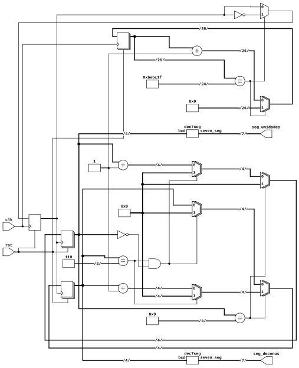

# CONTADOR DE SEGUNDOS CON DOS DISPLAYS 7 SEGMENTOS

En esta práctica de laboratorio número 3 se implementará un contador de segundos con dos 7 segmentos utilizando la FPGA de la Colorlight 8.2.
En primera instancia creamos las tablas de verdad correspondientes y la estructura de compuertas logicas basado en estas. Compararemos resultados con el diagrama RTL generado a partir del MAKEFILE. Por ultimo se sintetiza y se generan los archivos correspondientes para laimplementacion en la FPGA.

## 1.  COMPORTAMIENTO
- **DIAGRAMA DE FLUJO**
- **TABLAS DE VERDAD**
    

  
📸 Imagen RTL

  
   
  
  

---
## ESTRUCTURA
- **DIAGRAMA DE BLOQUES**
- **REDES DE COMPUERTAS**
---
## DISEÑO HDL
---
## RTL

  
📸 Imagen RTL

  
   
  
  

---
## SIMULACIÓN
---
## IMPLEMENTACIÓN 
- **PLACE AND ROUTE**
