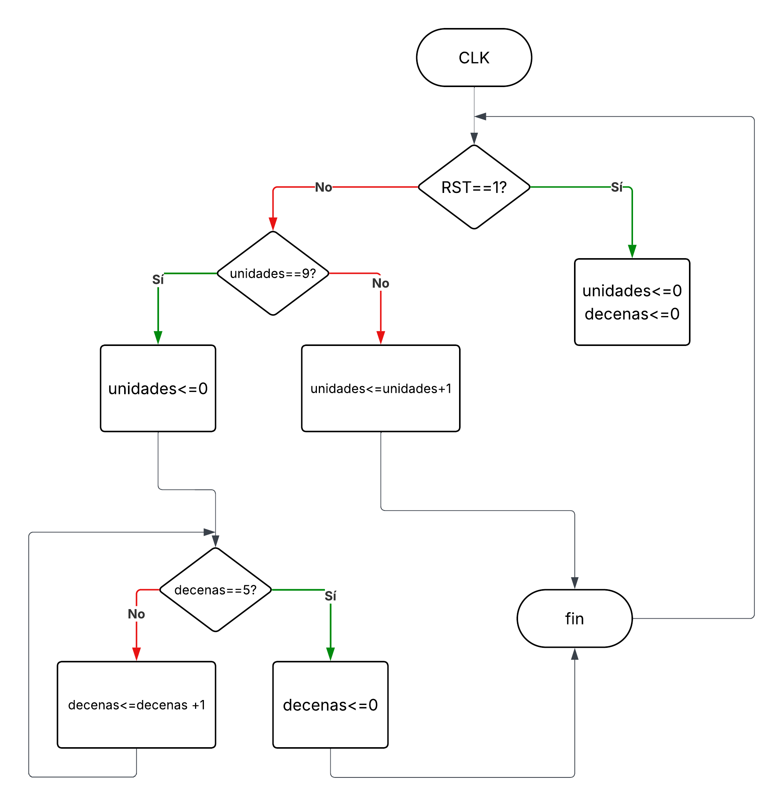
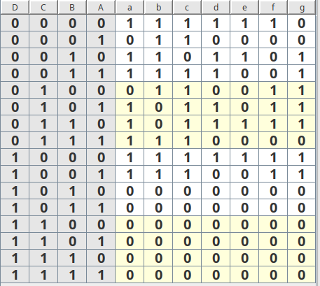
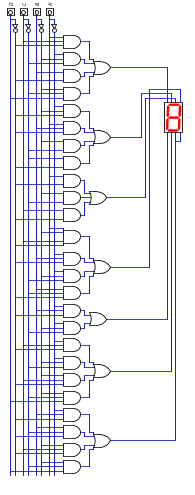

# CONTADOR DE SEGUNDOS CON DOS DISPLAYS 7 SEGMENTOS

En esta práctica de laboratorio número 3 se implementará un contador de segundos con dos 7 segmentos utilizando la FPGA de la Colorlight 8.2.
En primera instancia creamos las tablas de verdad correspondientes y la estructura de compuertas logicas basado en estas. Compararemos resultados con el diagrama RTL generado a partir del MAKEFILE. Por ultimo se sintetiza y se generan los archivos correspondientes para laimplementacion en la FPGA.

## 1.  COMPORTAMIENTO
- **DIAGRAMA DE FLUJO**
  
  

     
📸 Diagrama de flujo

  
      
  
     

    

    

- **TABLAS DE VERDAD**
    
    

     
📸 Tabla de verdad unidades

  
      
  
     

    

    

---
## 2. ESTRUCTURA
- **DIAGRAMA DE BLOQUES**
    

     
📸 Diagrama de Bloques

  
      
  
     

    

    
- **REDES DE COMPUERTAS**
    

    
📸 Circuito lógica de salida

          
   
          
  
        
    

---
## 3. DISEÑO HDL
---
## RTL

  
📸 Imagen RTL

  
   
  
  

---
## 4. SIMULACIÓN
---
## 5. IMPLEMENTACIÓN 
- **PLACE AND ROUTE**
